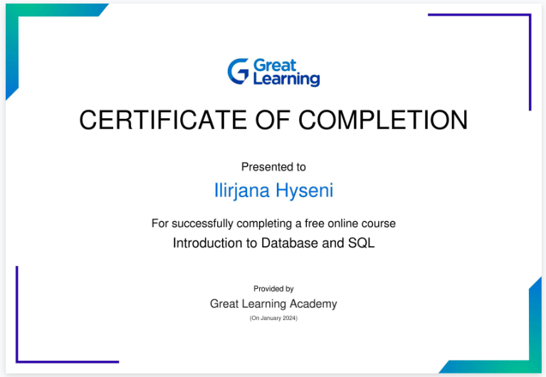

# SQL Learning Documentation

## Setting up MySQL Server and Workbench on MacOS

1. Ensure compatibility checks with MacOS version and between Server and Workbench. 
2. Download MySQL Server: [macOS](https://downloads.mysql.com/archives/community/) Product version: **8.0.30**, macOS 12 (x86, 64-bit), DMG Archive	Jul 7, 2022	455.4M

   - Set a password for the MySQL root user. This is an important security step; the root user in MySQL has full access to all databases and tables.

3. Download [MySQL Workbench](https://downloads.mysql.com/archives/workbench/) separately, Product version: **8.0.30**, macOS (x86, 64-bit), DMG Archive	Jul 5, 2022	113.0M	
	
   - Use the same MySQL root user password.

## Coursework
### Intro to DB and SQL
**Module 1: Introduction to SQL**
- **Topics Covered**:
	- Basic SQL functions (`SELECT`, `FROM`, `LIMIT`) and data types (`int`, `varchar`, `char`, `bigint`, `date`, `decimal`).
- **Key Learnings**:
  	- Foundational syntax of SQL queries, data selection, and the significance of different data types in database integrity and design.

**Module 2: Fetching Data**
- **Topics Covered**:
	- SQL commands for data retrieval (`SELECT`, `DISTINCT`, `INSERT`, `UPDATE`, `DELETE`).
- [**Code Snippets**](https://github.com/ilirjanahyseni/SQL-learning-repo/blob/main/fetching-data.sql): Demonstrate proficiency in basic CRUD (Create, Read, Update, Delete) operations in SQL.

**Module 3: Filtering Data**
- **Topics Covered**:
	- Using `WHERE`, `IN`, `LIKE`, `BETWEEN`, `AND`, `OR`, `NOT` for data filtering.
- [**Code Snippets**](https://github.com/ilirjanahyseni/SQL-learning-repo/blob/main/filtering-data.sql): Displayed the ability to extract relevant information from large datasets using various filtering techniques.

**Module 4: Aggregation**
- **Topics Covered**:
	- Aggregate functions (`SUM`, `AVG`, `MIN`, `MAX`, `COUNT`).
	- `GROUP BY`, `ORDER BY`, `CASE WHEN`.
- [**Code Snippets**](https://github.com/ilirjanahyseni/SQL-learning-repo/blob/main/aggregation.sql): Showcased the use of aggregate functions to perform complex data summaries and analyses.

**Module 5: Joining Tables**
- **Topics Covered**:
	- Different types of joins (`INNER JOIN`, `LEFT JOIN`, `RIGHT JOIN`, `UNION`, `FULL JOIN`, `CROSS JOIN`).
- [**Code Snippets**](https://github.com/ilirjanahyseni/SQL-learning-repo/blob/main/joining-tables.sql): Demonstrated competence in merging data from multiple tables to form comprehensive datasets.

**Module 6: Order of Execution in SQL**
- **Topics Covered**:
	- Sequence of SQL command execution (`FROM`, `WHERE`, `GROUP BY`, `HAVING`, `SELECT`, `ORDER BY`, `LIMIT`) and its impact on query efficiency.
- **Application**: Understanding and applying this order is crucial for writing efficient, accurate queries and for troubleshooting and optimizing existing queries.

## Certificates

## Resources and Refrences

[Great Learning](https://olympus.mygreatlearning.com/courses/84180)

[Learning Materials and Notes](https://github.com/ilirjanahyseni/SQL-learning-repo/blob/main/commands-queries.xlsx)
